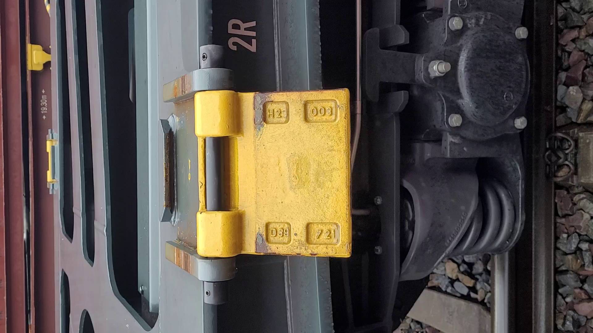
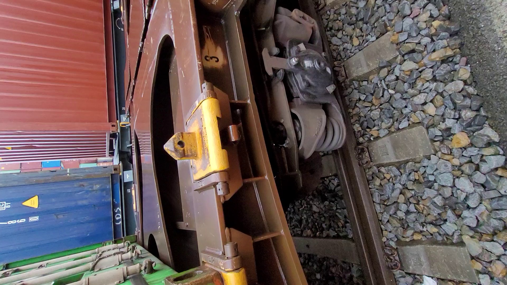
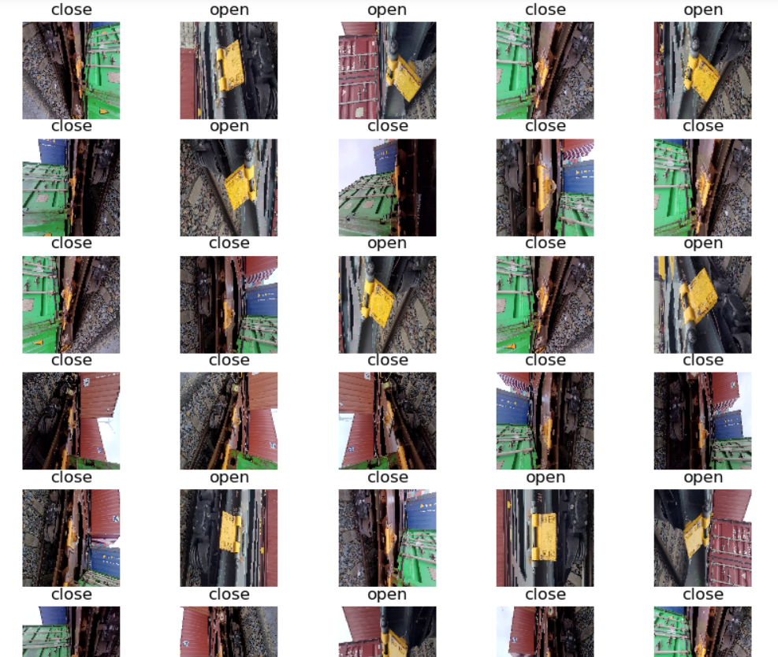

 
 

# Pin Classifier (open/close) 
This repository consists of 3 files: 
- ## **VideoToImage** : 
    to generate images from video 

- ## **PinClassifier**:  
    CNN model to classify pin state (open/close) 

- ## **main**: 
    the main implementation of the code 

- ## **others**: 
    - **Classifier_Notebook**: jupyter notebook version of the code, it is better using it for the first time training the model. 
    - **pin_mode.h5**: a model with loaded weights that is ready to be used. 
    - **pin_dataset**: a folder containing pins' images 
    
 Open             |   Close
:-------------------------:|:-------------------------:
  |  

## Getting Started 

### Running ### 

1. Clone this project. 
    - 
    ~~~bash
    $ git clone git@gitlab.cc-asp.fraunhofer.de:cml-160/pin-handling-mr/pin-handling-mr_sw/computer-vision/pin-classification.git
    ~~~

2. Go to the workspace: 
    -  
    ~~~bash
    $ cd pin-classification/
    ~~~
    
3. Edit main variables: 
    -  
    ~~~bash
    IMG_SHAPE, EPOCHS, load_model , etc...
    ~~~

4. run main file: 
    -  
    ~~~bash
    $ python main.py
    ~~~

### Current Results ### 

`val_loss: 0.0000002505`

    

 :star: :star: :star:  

